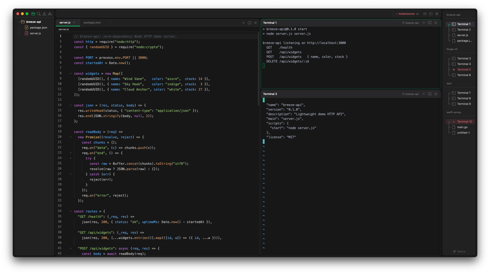

# Splice

**One window. Every project.**

Splice is a native macOS developer environment built on Rust and Tauri. Isolated workspaces, a Snakebite-powered terminal, a full code editor, and first-class support for AI coding agents — all in a single window that starts fast and stays lean.

[**Download for macOS →**](https://github.com/adrian-kimbrell/splice/releases/latest)
[](https://github.com/adrian-kimbrell/splice/actions/workflows/ci.yml)
[](LICENSE)



> **Gatekeeper note:** Splice is not yet notarized. If macOS shows a "damaged" warning on first launch, run `xattr -cr /Applications/Splice.app` in Terminal, then open normally.

---

## Workspaces

Most editors give you one context and expect you to manage the rest yourself — a mess of terminal tabs, jumbled file trees, constant context-switching. Splice solves this with workspaces.

Each workspace is a fully isolated environment:

- **File tree** scoped to its own root folder
- **Terminal sessions** that keep running when you switch away
- **Editor state** — open files, tabs, scroll positions, all preserved
- **Pane layout** — your arrangement of editors and terminals, per project

Switch instantly with `Cmd+Opt+Shift+←/→`. Everything is exactly where you left it.

Session state is written to disk on every change and fully restored on relaunch — workspaces, layouts, open files, and terminal working directories.

---

## AI-native workflows

Splice is built for the way AI-assisted development actually works: multiple agents running across multiple terminals and projects, while you stay focused on your own work.

The **attention hook system** integrates directly with Claude Code and OpenAI Codex. A small hook is installed into `~/.claude/hooks` that fires on agent events and signals Splice via a named pipe. Splice tracks which terminals have active agents, detects permission prompts and idle states, and surfaces alerts in a persistent footer bar — without interrupting your flow. Multiple alerts stack in a dropdown; click one to jump straight to that terminal.

---

## Terminal

Splice ships a custom terminal emulator — no xterm.js, no DOM-per-character rendering.

- **Snakebite renderer** — text and cursor drawn directly to an `HTMLCanvasElement`. Only dirty rows are repainted. Renders at up to ~120fps.
- **Rust PTY backend** — `portable-pty` manages the pseudoterminal. Output is parsed in Rust using `vte`, which handles ANSI escape sequences, SGR attributes (including sub-parameters for underline style/color), OSC, and DCS. Processed events are sent to the frontend over a binary protocol with a fixed 20-byte header.
- **10,000-line scrollback** — maintained in Rust as a ring buffer. The frontend requests viewport slices on demand; no full-buffer serialization.
- **In-terminal search** — full-text search across scrollback with live match count, prev/next navigation, and row/column highlighting.
- **Full colour** — 256-colour and 24-bit truecolor, bold/italic/dim/strikethrough/underline (including curly/dotted/dashed variants), hyperlinks, and wide character support.

---

## Editor

CodeMirror 6 with LSP integration:

- **Language servers** — TypeScript (`typescript-language-server`), Rust (`rust-analyzer`), Python (`pylsp`). Splice checks for each server on workspace open and offers one-click install if missing.
- **LSP features** — completions, hover docs, go-to-definition, diagnostics with inline decorations, rename, and code actions.
- **Editor features** — syntax highlighting, minimap, bracket matching, breadcrumb navigation, image preview, Markdown preview.
- **Tab model** — preview tabs (single-click) promoted to permanent (double-click or edit). Drag tabs between panes or drop to an edge to create a new split.

---

## Layouts

- Split any pane horizontally or vertically into a terminal or editor
- Drag the divider to resize; double-click to reset
- `Cmd+Z` to zoom any pane full screen and back
- `Cmd+Opt+Arrow` to navigate between panes without touching the mouse
- Each workspace remembers its own layout independently

---

## SSH remote workspaces

Connect to a remote host over SSH and work as if it were local:

- Browse and interact with the remote file tree via SFTP
- Open, edit, and save remote files (read/write over SFTP)
- Remote terminals spawned with the correct working directory
- Connection config (host, port, user, key path, remote path) stored per workspace

---

## Multi-window

`Cmd+Shift+N` opens a second window. Each window maintains its own workspace set, persisted to a separate config file. Close a window and it's gone; crash and it's restored on next launch.

---

## Keyboard shortcuts

| Shortcut | Action |
|---|---|
| `Cmd+Opt+Shift+←/→` | Switch workspace |
| `Cmd+Opt+Arrow` | Navigate panes |
| `Cmd+Z` | Zoom / unzoom pane |
| `Cmd+K` | Command palette |
| `Cmd+Shift+N` | New window |
| `Cmd+N` | New file |
| `Cmd+S` | Save |
| `Cmd+B` | Toggle file explorer |
| `Cmd+F` | Find (editor or terminal) |
| `Cmd+=` / `Cmd+-` | Zoom UI |
| `Cmd+,` | Settings |

---

## Build from source

**Prerequisites:** Node.js 18+, Rust stable, [Tauri CLI](https://v2.tauri.app/start/prerequisites/)

```bash
git clone https://github.com/adrian-kimbrell/splice
cd splice
npm install
cargo tauri dev        # dev mode with hot reload
cargo tauri build      # production build
```

---

## Stack

| Layer | Technology |
|---|---|
| Desktop framework | Tauri v2 |
| Backend | Rust |
| Frontend | Svelte 5 (runes) |
| Editor | CodeMirror 6 |
| Terminal renderer | Snakebite (custom Canvas 2D) |
| Terminal parsing | `vte` |
| PTY | `portable-pty` |
| File watching | `notify` (FSEvents) |
| SSH / SFTP | `openssh` crate |

---

## License

MIT
